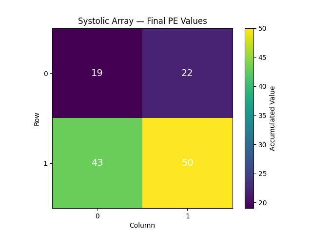
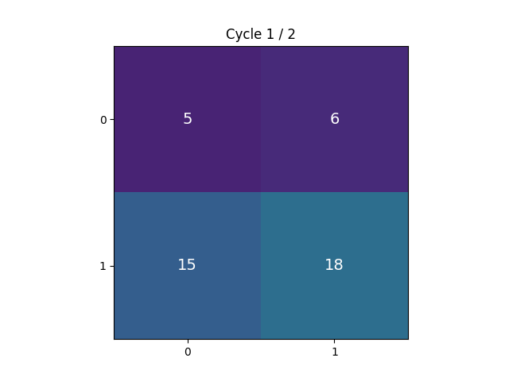

# Tiny NPU Simulator

A from-scratch simulator of a small NPU-style systolic array, built in Python. Models the core building blocks of parallel AI hardware — instruction set, memory, processing elements, and a cycle-accurate systolic array — and uses them to perform real matrix multiplication, verified against NumPy.

## What it does

- Implements a minimal 6-instruction ISA (`LOAD`, `STORE`, `MAC`, `ADD`, `MUL`, `NOP`)
- Simulates a global memory model and per-core registers
- Builds an NxN grid of Processing Elements (PEs) that compute in parallel, like a real systolic array in NPU/TPU hardware
- Performs matrix multiplication by mapping it onto the PE grid, with each PE computing one output element via multiply-accumulate (MAC)
- Tracks cycle-accurate timing, comparing parallel execution against a naive single-core baseline
- Verifies output correctness against `numpy.matmul()`
- Visualizes the array's state as a static heatmap and a cycle-by-cycle animation

## Results

For a 2x2 matrix multiplication on a 2x2 PE grid:

| Metric | Naive (single core) | Systolic array (parallel) |
|---|---|---|
| Cycles | 8 | 2 |
| Speedup | — | **4x** |

Output verified to exactly match NumPy's `matmul()`.

## Visuals

**Final PE grid values:**



**Cycle-by-cycle execution:**



## Why this project

Real NPUs and TPUs use systolic arrays to accelerate matrix multiplication — the core operation behind neural networks. This project simulates that architecture at a conceptual level: how parallel processing elements, memory access patterns, and cycle timing combine to produce real speedups over sequential execution.

## Run it

```bash
pip install numpy matplotlib pillow
python main.py
```

## Tech stack

Python, NumPy, Matplotlib
